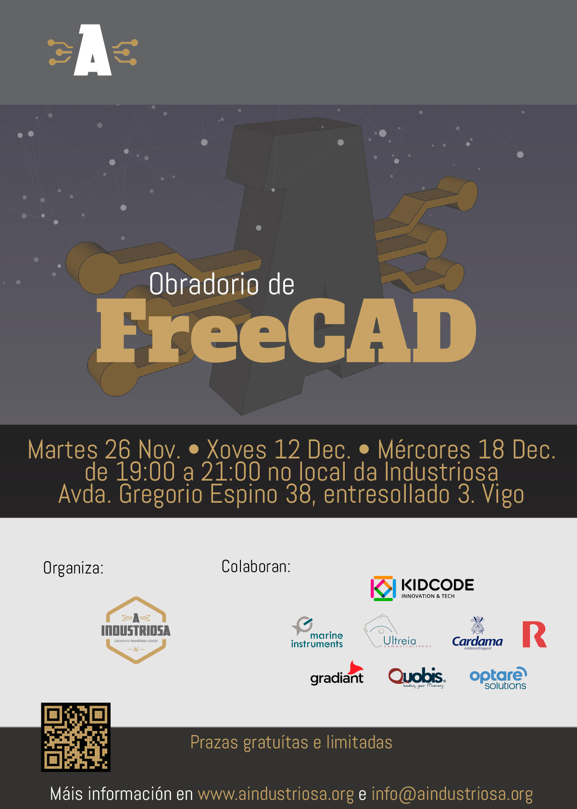

# Obradoiro FreeCAD

FreeCAD (https://www.freecad.org/) é un programa de modelado paramétrico 3D moi versátil e adecuado para diversidade de perfís de usuario.

Ademais, é software libre, multiplataforma (Windows, MacOS e GNU/Linux) e gratuíto. A súa versatilidade fai deste programa un complemento ideal para a impresión 3D e a fabricación dixital, en xeral.

Aprenderemos a manexar a última version que esta a piques de sair, o FreeCAD 1.0.0 (https://github.com/FreeCAD/FreeCAD/releases).

# Vídeos

## Martes 26 de Novembro

### Módulo 1: Introducción a FreeCAD
Obxetivo: Instalar e coñecer o programa FreeCAD e aprender a moverse na
súa contorna.
Temas a ver:
• Que é FreeCAD? Como instalalo
• Percorrido polas ferramentas principais e a área de traballo.
• Como moverse no espazo 3D: achegarse, afastarse, virar e desprazarse.
• Como gardar e diferentes arquivos que permite exportar.
Práctica: Crear un arquivo novo, axustar a vista e gardar o traballo.
O que se aprenderá: Familiarizaranse con FreeCAD, entendendo como é a súa contorna de traballo e manexando as ferramentas principais, para poder desenvolverse con soltura no programa.

### Módulo 2: Modelado Paramétrico
Obxectivo: Descubrir como facer modelos e cambiar facilmente sen ter que volver facelos
desde cero.
Temas a ver:
• Que é o deseño paramétrico e por que é útil.
• Como agregar medidas específicas nos bosquexos para axustar o deseño.
• Modificar as dimensións para actualizar o deseño rapidamente.
Práctica: Crear unha peza sinxela, como unha arandela, axustando as dimensións para ver como cambia o deseño.
O que se aprenderá: Coñecerán como crear deseños que se poidan modificar rapidamente, facéndoos máis versátiles.

https://youtu.be/nmTyFVzHlzo

https://youtu.be/eXRnwWvNWPI

https://youtu.be/kcHCAthQ4go
